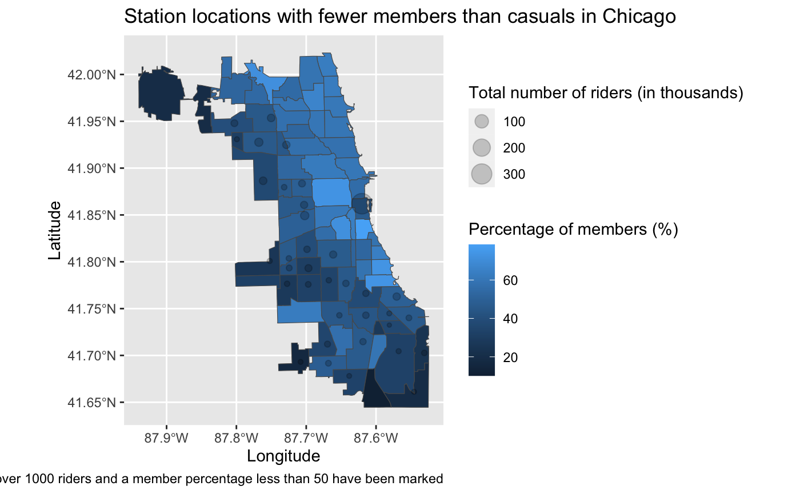
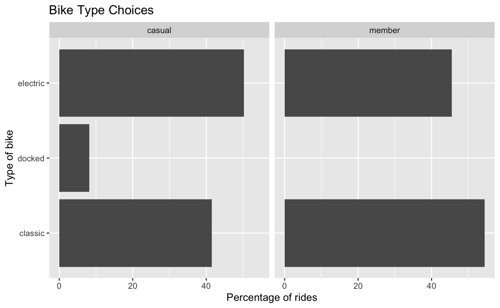
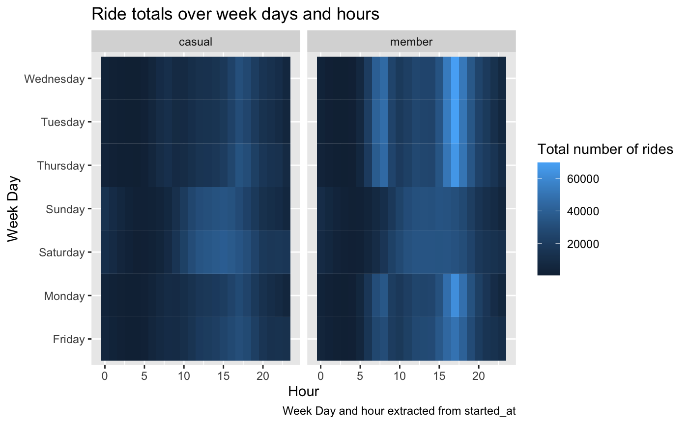

# CyclisticAnalysis

As a capstone project to earn the Google Data Analytics Certificate, I created a report in R analysing the data (and detailing my approach) for a given (fictional) company.

Goal: Using generated data for a fictional bike-share company, Cyclistics, to: investigate the differences between members and casual riders in their usage of Cyclistic bikes to better understand how to convert casual riders into members.

[Summary report can be viewed here](https://htmlpreview.github.io/?https://github.com/kimathinyota/CyclisticAnalysis/blob/main/CyclisticsFindings.html ) 

## Snippets of Report

### A graphic highlighting the areas with fewer members than casuals that the company can target. 

### A graphic showing the different bike type choices of members and casuals

### A graphic showing how the total number of rides taken vary for both casual and members

## Project Files

| HTML Report  | Knitted from R-Markdown File |
| ------------- | ------------- |
| [Report summarising analysis](https://htmlpreview.github.io/?https://github.com/kimathinyota/CyclisticAnalysis/blob/main/CyclisticsFindings.html )   | [CyclisticsFindings.Rmd](CyclisticsFindings.Rmd)  |
| [Detailed report on the specifics steps taken (cleaning; processing) and justification for decisions made during the analysis](https://htmlpreview.github.io/?https://github.com/kimathinyota/CyclisticAnalysis/blob/main/CyclisticsWriteUp.html ) | [CyclisticsWriteUp.Rmd](CyclisticsWriteUp.Rmd)  |

